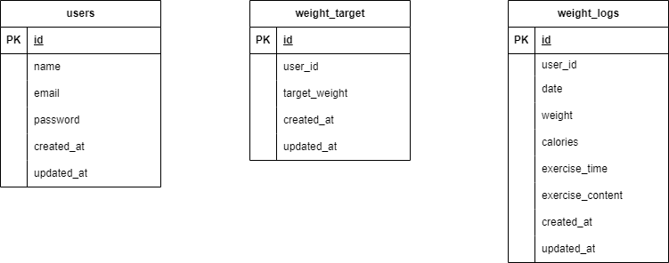

# test3
# Pigly（体重管理アプリ）

## 環境構築

### Dockerビルド

1. git clone `git@github.com:Sao-Hao/test3.git`
2. Docker Desktop アプリを立ち上げる
3. docker-compose up -d --build

### Laravel環境構築

1. docker-compose exec php bash
2. composer install
3. `.env.example` ファイルを `.env` にリネーム。または新しく `.env` を作成
4. `.env` に以下の環境変数を追加

    ```
    DB_CONNECTION=mysql
    DB_HOST=mysql
    DB_PORT=3306
    DB_DATABASE=test3
    DB_USERNAME=laravel_user
    DB_PASSWORD=laravel_pass
    ```

5. アプリケーションキーの作成

    ```
    php artisan key:generate
    ```

6. マイグレーションの実行

    ```
    php artisan migrate
    ```

7. シーディングの実行

    ```
    php artisan db:seed
    ```

## 使用技術（実行環境）

- PHP 7.4.9
- Laravel 8.83.29
- MySQL 8.0.26

## URL

- 開発環境: http://localhost/
- phpMyAdmin: http://localhost:8080/

## ER図


